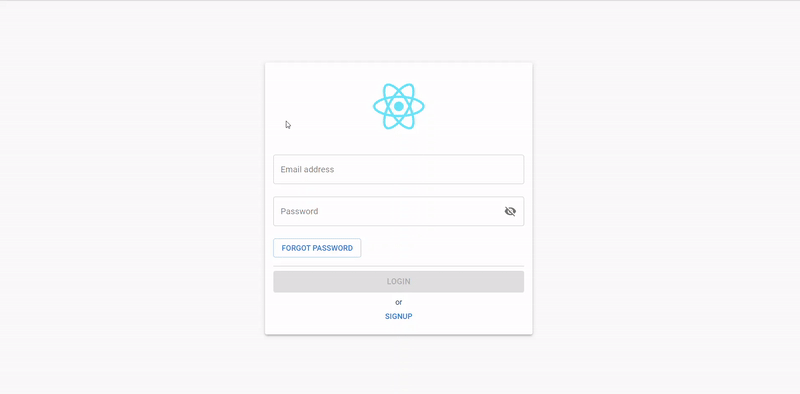
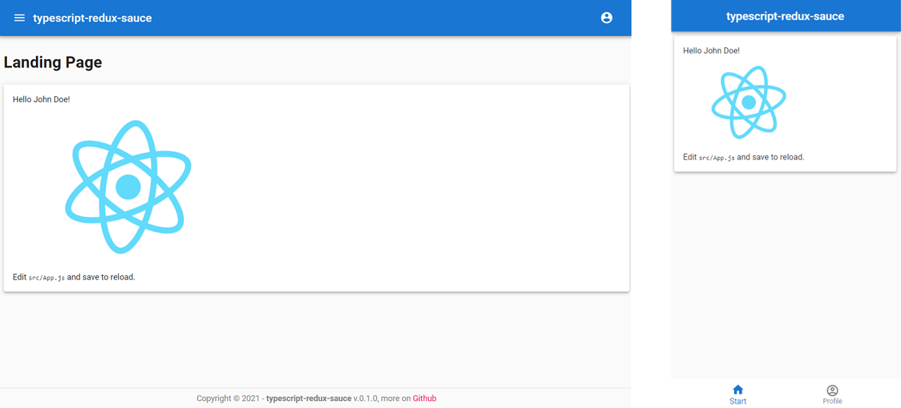

# A quick start Typescript + Redux + Material-UI template
This is a [Create React App](https://github.com/facebook/create-react-app) (CRA) typescript _template_, which allows a quick project start by already having a basic design styled by **Material-UI** and a fully functional and responsive **navigation** including authentication flow, state management via **Redux** and **Redux-Persist** and asynchronous side effects with **Redux-Sagas** already configured.

## Usage

```bash
npx create-react-app your-project-name --template typescript-redux-sauce
```

Or

```bash
yarn create react-app your-project-name --template typescript-redux-sauce
```

`npx` command installs the most recent stable version of CRA from npm.

`--template` parameter points to this template, note that `cra-template-` prefix is omitted.

## Motivation
Having created several projects from scratch, I've noticed that before a new project can really get started, it always requires the same repetitive work:
- First I have to create a basic folder structure
- Then I add a basic navigation
- For the actual state management I use Redux, where the writing of the boilerplate takes a lot of time
- Furthermore the state should be persistent, so Redux-Persist has to be configured
- Finally, for better clarity, I want to separate side effects (like loading data from the server) from the actual logic using Redux-Sagas

Since I don't want to spend hours configuring projects, but rather get straight to development, I have created this template that can be used by anyone who wants to use a similar structure.

## What is included
This template offers a basic design, with a **responsive navigation** and a fully functional **authentication flow**.

### Authentication flow
Enjoy an already pre-styled and functional login and registration form, where all side effects (such as requests to the server) have already been programmed in the form of appropriate sagas, where only the actual request needs to be added



Authentication is made possible through two different types of routes, namely `LayoutRoute` and `AuthenticatedRoute`. While pages using a `LayoutRoute` can be accessed by anyone, users are automatically redirected to the login page when accessing a `AuthenticatedRoute`. After login, the user is then redirected back to the desired route.

The following is an exemplary use of the two route types:
```jsx
<LayoutRoute
    exact
    path="/signup"
    layout={EmptyLayout}
    component={(props : any) => (
        <AuthPage {...props} authState={"SIGNUP"} />
    )}
/>
<AuthenticatedRoute
    exact
    path="/profile"
    title="Profile"
    layout={MainLayout}
    component={ProfilePage}
/>
```

### Responsive navigation
By default, desktop navigation is handled by a **sidebar**, while a **tabBar** is used on the phone.
The type of navigation can be easily customized in the `MainLayout`.



For the sidebar as well as for the tabBar the available navigation items can be specified via a list, where path, name, icon and whether subroutes also apply are defined.
```jsx
const navItems : {to: string, name: string, exact: boolean, Icon: any}[] = [
    { to: '/', name: 'Start', exact: true, Icon: HomeIcon},
    { to: '/profile', name: 'Profile', exact: true, Icon: AccountIcon},
];
```


## Available Scripts

In the project directory, you can run:

- `yarn start` - runs the app in the development mode. Open [http://localhost:3000](http://localhost:3000) to view it in the browser.

- `yarn test` - launches the test runner in the interactive watch mode.

- `yarn build` - builds the app for production to the `build` folder.

- `yarn eject` - exposes content of `react-script` package

## Redux configuration
This template provides a basic Redux configuration, with `Redux-Persist` to persist and rehydrate the redux store, `Redux-Saga` for more structured side effects as well as `reduxsauce` to make the code a bit more readable.  

## Folder structure
The basic folder structure looks like this:
``````
your-project-name
├── public
|   └── index.html
├── src
|   ├── __test__
|   ├── assets
|   ├── components
|   ├── pages
|   ├── redux
|   ├── sagas
|   ├── styles
|   ├── utils
|   ├── App.js
|   └── index.js
├── .env
└── package.json
``````
All React Nodes that can be navigated to via routing are stored in the `pages` folder.
Such a page can consist of any number of `components`, which are stored in the respective folder.
As the name suggests, all Sagas are stored in the `sagas` folder and all the code for redux is stored in the `redux` folder.
Additional useful functions such as custom hooks can be stored in the `utils` folder.

## Styles/CSS/Styling
For the styling of this skeleton app I used [Material UI](https://material-ui.com/), which is based on Material Design.
This includes components like a header, sidebar, tabBar navigation on mobile as well as a sample login and registration form.
